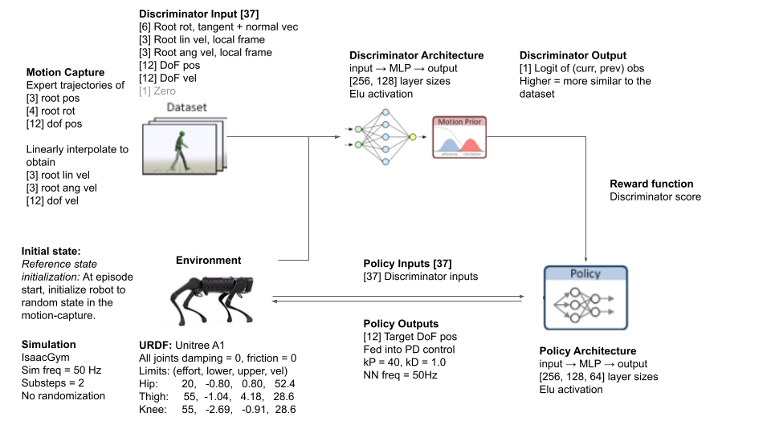
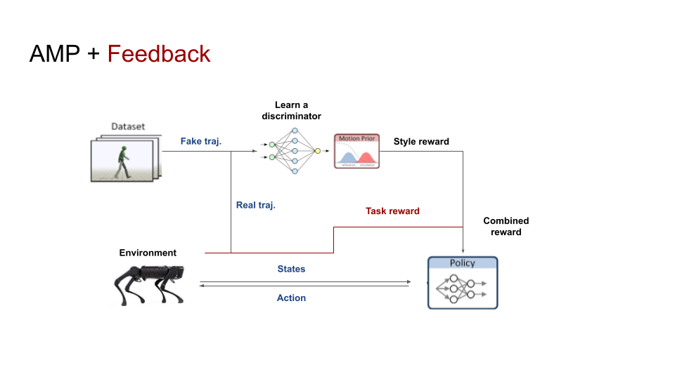
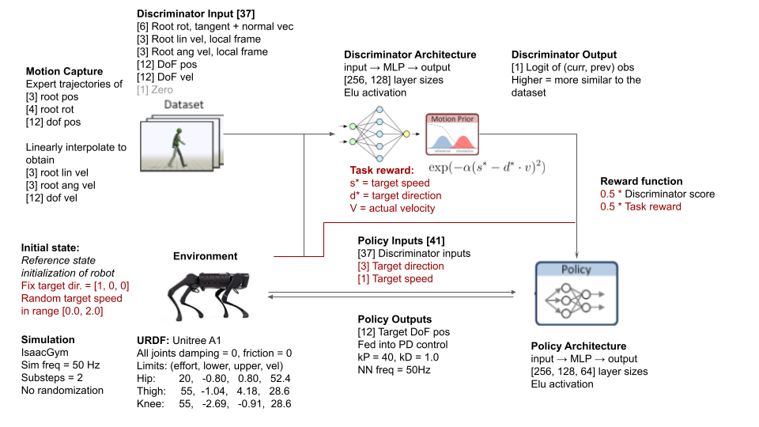
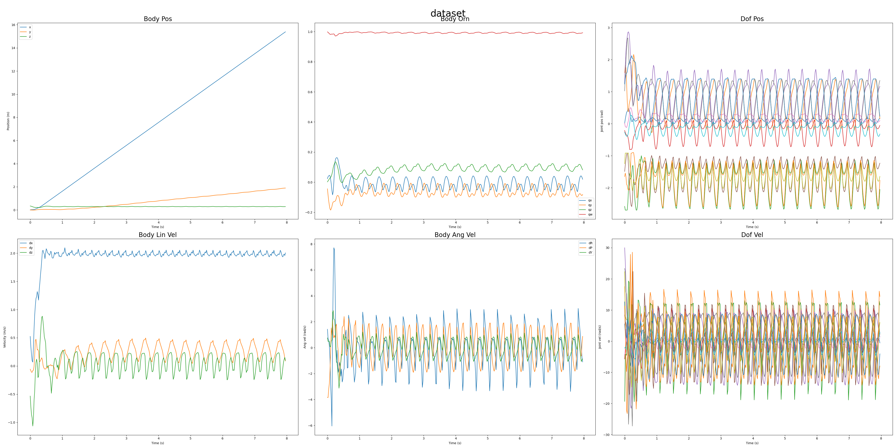
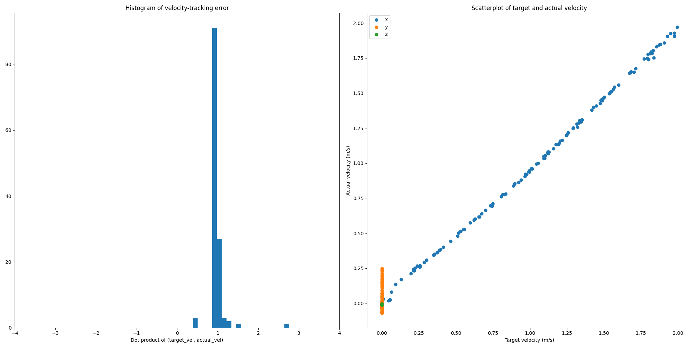

# 8 Mar Update

## Overview

This week, we're interested in implementing  for feedback-controllable policies. 


## AMP

As a recap, [adversarial motion priors (Peng, 2019)](https://arxiv.org/abs/2104.02180) are a generalized method of adversarial imitation learning. 



In place of a fixed reward function, a discriminator is used to evaluate the similarity of a policy's behaviour to a known dataset, and the logit of the real action is used as the reward. 

The benefits include: 
- Minimal reward engineering required
- Flexibly and scalably specify desirable behaviour through demonstrations

## AMP + Feedback 

Pure AMP produces non-controllable policies, in the sense that the policy's behaviour is fully determined by the initial state; i.e. we cannot influence the policy's behaviour at test time. 

To enable the policy to accept high-level commands, we can combine the AMP-derived discriminator reward with a task-specific reward, as described in [Equation 4](https://arxiv.org/abs/2104.02180). 



We implement a simple proof-of-concept for a target-velocity-following task in the `QuadrupedAMP` 

## Method



## Results

### Sample Trajectory
A sample trajectory of various robot states is provided below. 


### Velocity-tracking
We evaluate velocity tracking over $$N=128$$ random seeds, with target direction fixed to be $$[1, 0, 0]$$ and target speed randomized in the range $$[0., 2.] m/s$$.


Despite being trained only on reference motions of speeds between 0.3 and 1.2 m/s, our policy can learn to travel up to 2.0 m/s

A video of the learned motion is available in Google Drive: https://drive.google.com/drive/folders/1PDJyRT8ubHQzPsSWIpw_OB3GY4x6A12e?usp=sharing

## Reproduction

A pre-trained checkpoint `QuadrupedAMP.pth` and sample dataset `dataset.h5` is provided here. The dataset can be generated with the following command:

```
# From isaacgymenvs directory
python train.py task=QuadrupedAMP task.env.motionFile=data/motions/quadruped/a1_expert/trot/dataset_trot.yaml num_envs=32 test=True checkpoint=../reports/8_mar/QuadrupedAMP.pth
```

The plots can be generated as follows:
```
python plotting/plot_target_vels.py -i ../reports/8_mar/dataset.h5 -o target_vel.png
python plotting/viz_dataset.py -i ../reports/8_mar/dataset.h5 -o trajectory.png
```